<h1>Taller 10 - Francia Johana Rodriguez Leon</h1>

<h2>Informacion</h2>

Curso: FullStack Basico - Grupo 1 

Profesor: Cristian Patiño

<h2>Puntos 1: Variables y Constantes</h2>
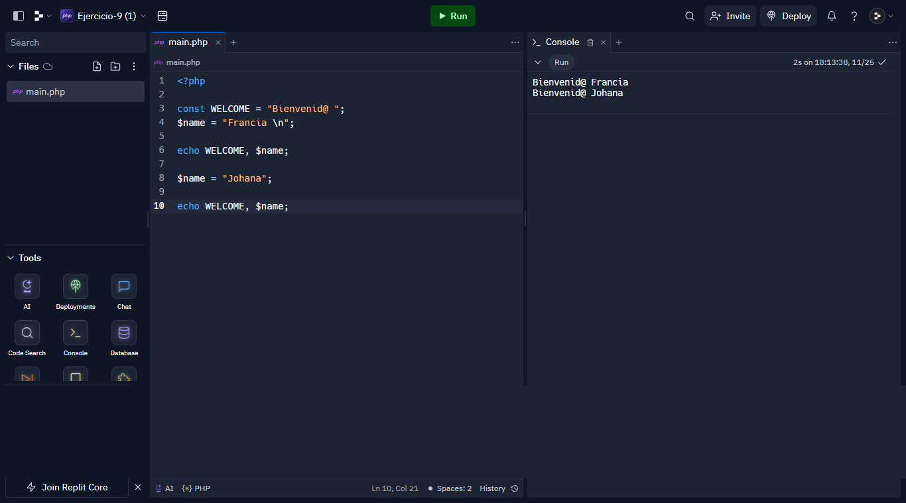

<h2>Puntos 2: Sumas de Constantes y Variables</h2>
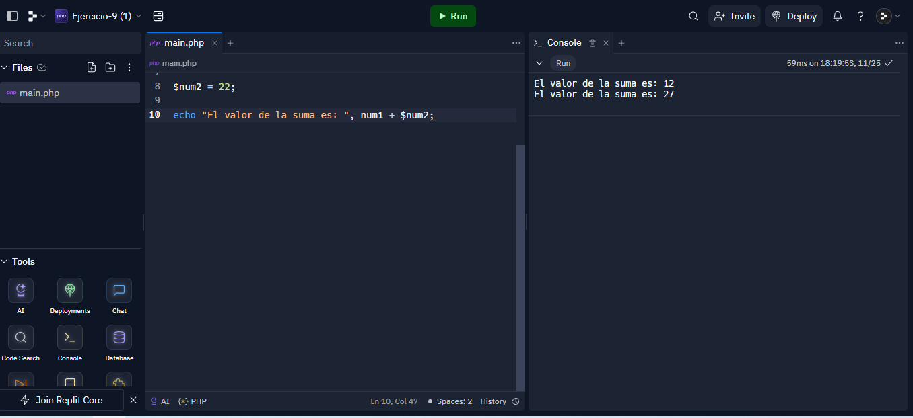

<h2>Puntos 3:Suma de dos numeros indicados por el usuario</h2>
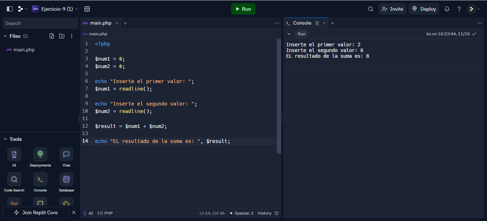

<h2>Puntos 4: Dtaos del usuario en consola</h2>
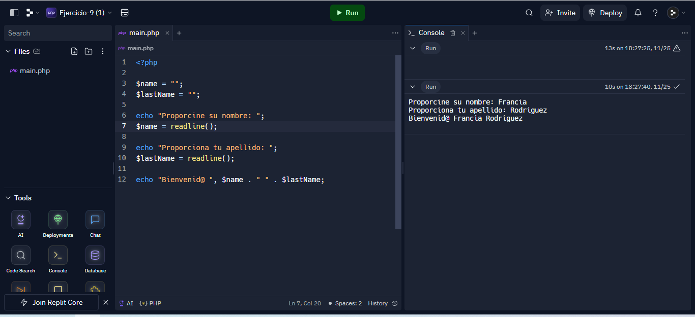

<h2>Puntos 5:Entrada de bolera usando if /else</h2>
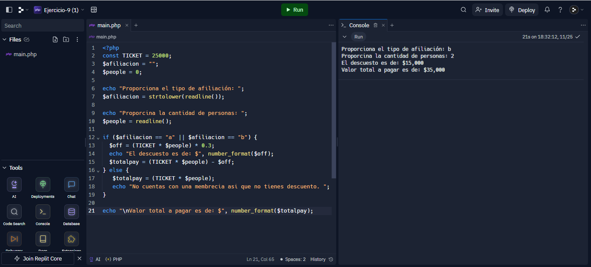

<h2>Puntos 6:Deteccion de mayoria de edad</h2>
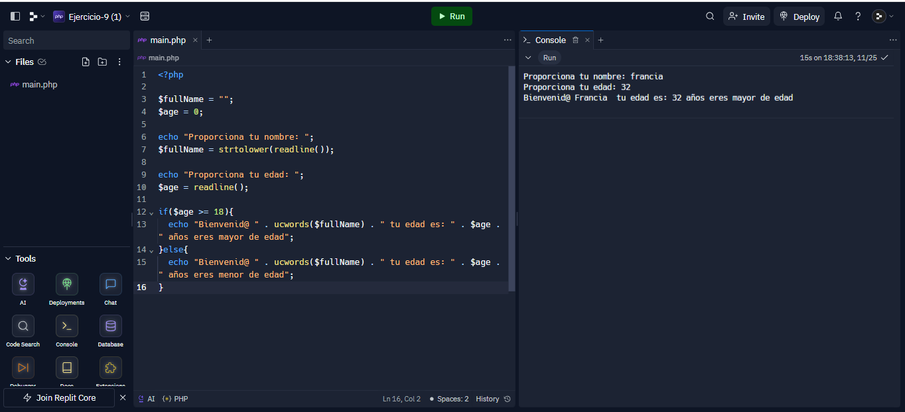

<h2>Puntos 7: Seleccion de operacion aritmetica</h2>
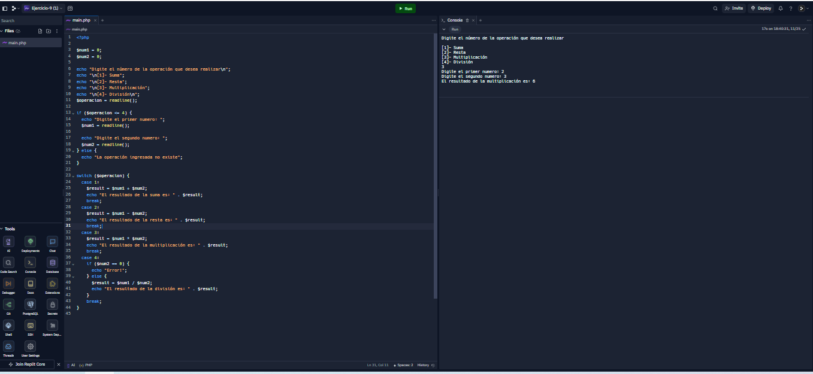

<h2>Puntos 8: Entrada de bolera usando Switch</h2>
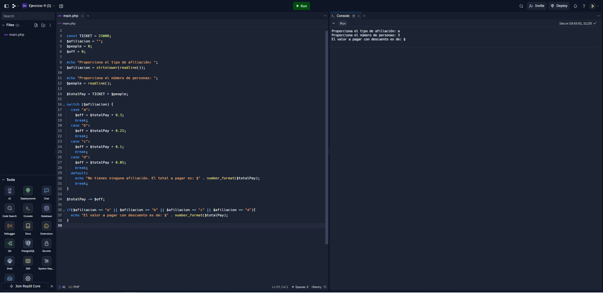

<h2>Puntos 9: Tabla de multiplicar usando while</h2>

<h2>Puntos 10: Numeros pares usando while</h2>
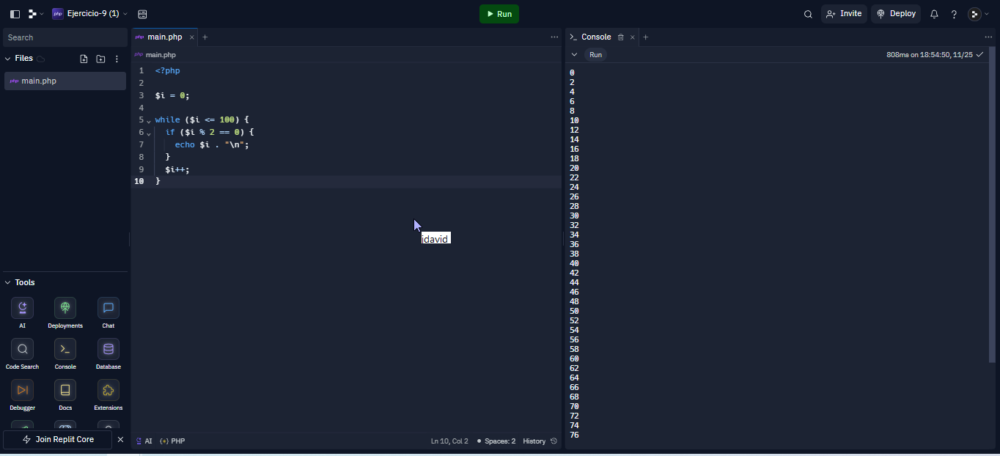

<h2>Puntos 11: Numeros impares usando for</h2>
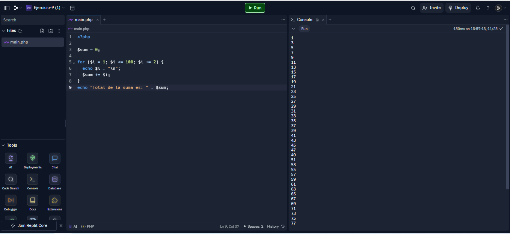

<h2>Puntos 12: Tabla de multiplicar usando for</h2>
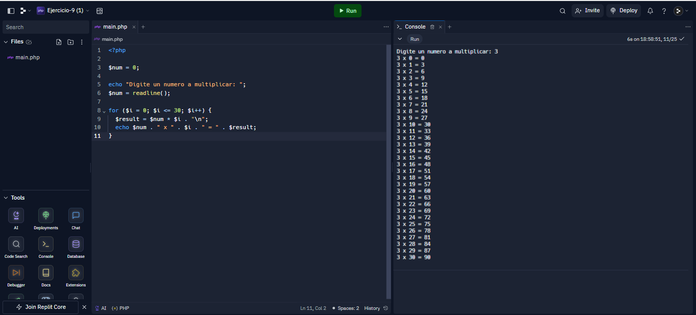

<h2>Puntos 13: Suma de valores de un arreglo usando foreach</h2>
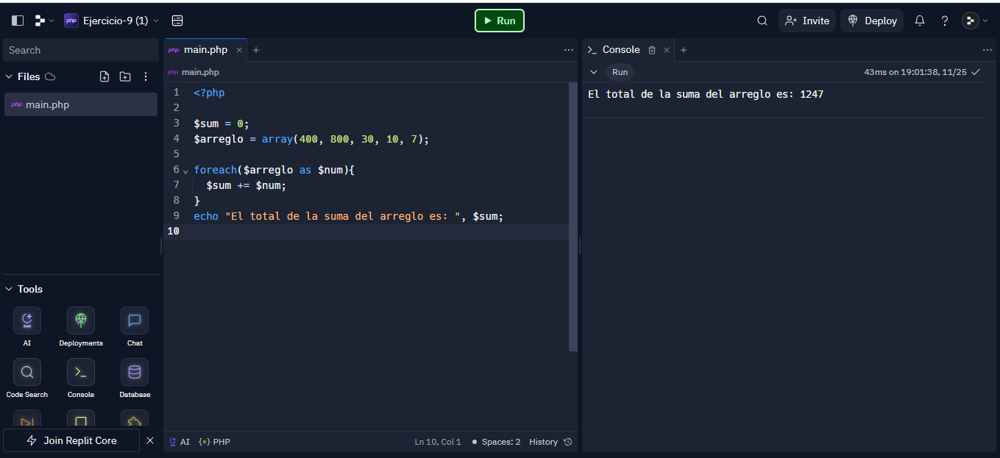

<h2>Puntos 14: Revision de contraseña</h2>
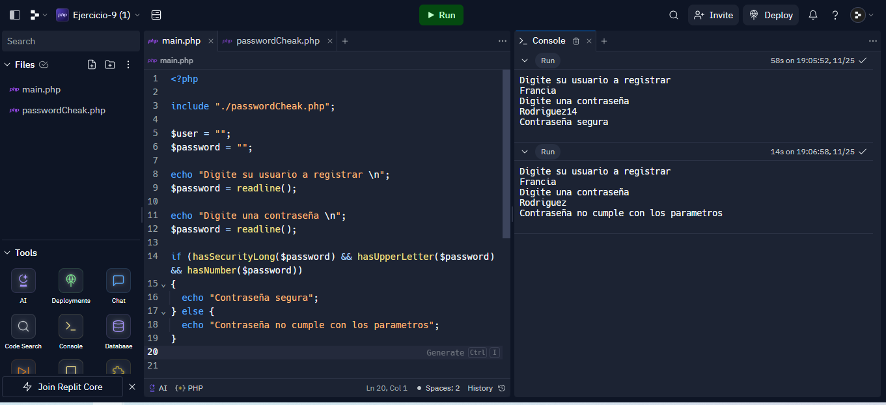
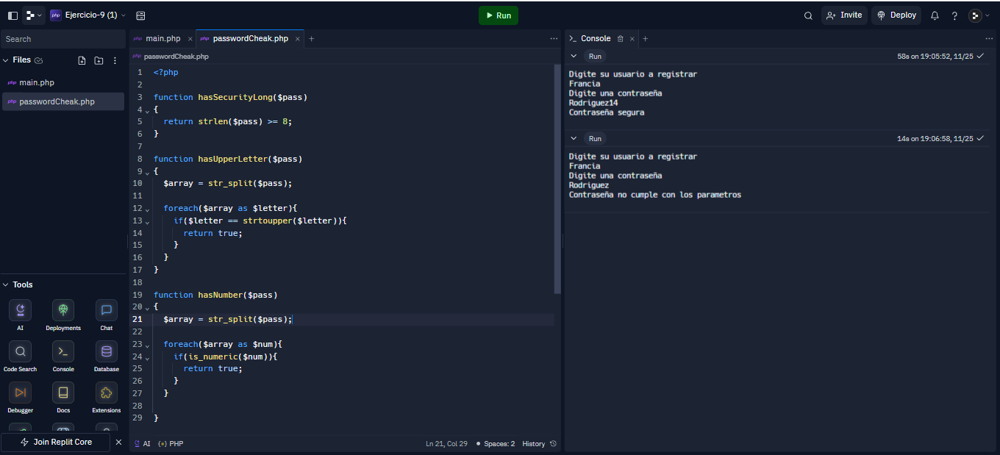

<h2>Puntos 15: Seleccion de operacion aritmetica usando funciones</h2>
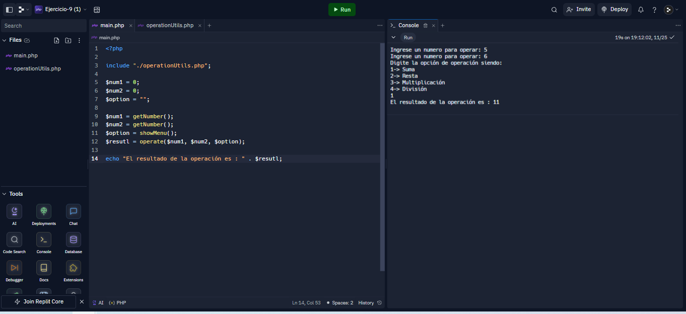
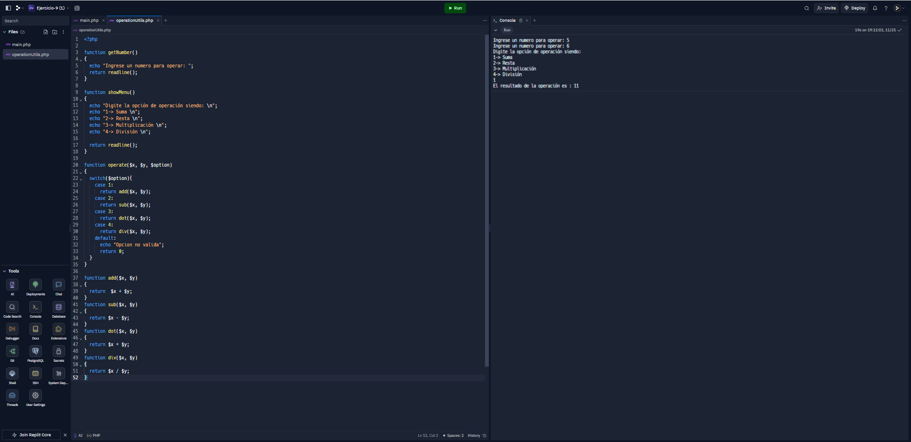
